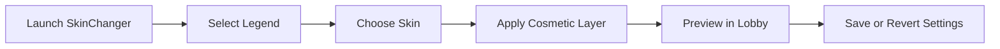

# Apex Legends SkinChanger 💎

Transform your legend’s style with the **Apex Legends SkinChanger**, a customization suite that lets you alter skins, banners, heirlooms, and weapon camos in real time. No grinding, no loot box RNG — just instant visual control that updates as you play.

This lightweight, secure utility modifies only the visual layer of the game, ensuring that your loadouts remain undetectable and your gameplay fully intact.

---

## 🎨 Overview

The **SkinChanger** doesn’t affect game balance or performance. It’s purely cosmetic, designed to help you create the aesthetic you want without relying on in-game RNG systems. Featuring a smooth interface, one-click presets, and automatic model restoration, it’s the ultimate personalization tool for Apex Legends players who value individuality.

---

## 🧩 Key Features

### 💎 **Legend Skin Selector**

* Unlock or swap any legend skin instantly.
* Includes all event and rare-tier outfits.
* Works for all current and legacy characters.

### 🔫 **Weapon Camouflage Editor**

* Apply animated or custom color schemes.
* Import `.dds` or `.png` files for personal designs.
* Includes real-time preview before application.

### 🧱 **Banner & Badge Customizer**

* Modify player banners, trackers, and poses.
* Create full custom sets to match your legend theme.

### 🪓 **Heirloom Skin Spoofing**

* Visually equips any heirloom model for your legend.
* Compatible with melee inspection animations.

[!WARNING]

> The SkinChanger only affects **local visuals** — other players will not see your changes online.

---

## 💻 Compatibility

| Platform      | Status          | Notes                              |
| ------------- | --------------- | ---------------------------------- |
| Windows 10    | ✅ Supported     | Stable DirectX 11 overlay          |
| Windows 11    | ✅ Supported     | Recommended for smoother rendering |
| Steam Version | ✅ Supported     | Instant cosmetic sync              |
| EA App        | ⚠️ Manual Setup | Requires directory path input      |

> **Accessibility Tip:** Color sliders include presets for color-blind accessibility (Protanopia, Tritanopia, Deuteranopia).

---

## ⚙️ Setup Guide

1. **Extract Package**
   Unzip the SkinChanger folder into your Apex Legends directory.

2. **Run as Administrator**
   Launch `ApexSkinChanger.exe` before starting the game.

3. **Start Apex Legends**
   Wait until the main menu loads, then open the overlay (`INSERT` key).

4. **Choose Skin Type**
   Pick between *Legend*, *Weapon*, or *Banner* tabs.

5. **Apply Changes**
   Hit `SAVE` to apply or `RESET` to restore default visuals.

[!NOTE]

> Skins are stored in temporary cache only; changes revert after closing the tool.

---

## 🧠 Example Config File

```ini
[SKINCHANGER]
enable=true
legend_skin=Wraith_Synthetic_Sunset
weapon_skin=R301_Cosmic_Carbine
banner_pose=Victory_Stance_3
heirloom=Wraith_Kunai
apply_on_launch=true
```

Each profile can be saved and swapped instantly through the overlay or using `CTRL + F9`.

---

## 🧭 Skin Application Flow



---

## ❓ FAQ

**Q1: Will others see my custom skins?**
No — visuals are local only and affect what *you* see. Online visibility remains unchanged.

**Q2: Can I use custom textures?**
Yes! You can import your own `.png` or `.dds` files for weapons and legends.

**Q3: Does it work with new updates?**
The SkinChanger auto-updates offsets via cloud sync whenever Apex Legends patches.

**Q4: Are heirlooms permanent?**
They’re visual-only. You can toggle them off anytime without risk or save multiple heirloom profiles.

**Q5: Is this safe to use on my main account?**
It does not interact with gameplay or servers, so it’s as safe as cosmetic mods can be — but always back up your config files.

---

## 🧩 Advanced Tips

* Save multiple profiles like `bloodhound_darkmode.cfg` or `octane_neon.cfg` for quick swaps.
* Use the `Quick Preview` button to cycle through skins during matchmaking queues.
* Pair with the in-game photo mode for content creation or thumbnails.

---

## 🏁 Final Thoughts

The **Apex Legends SkinChanger Tool** lets you fully personalize your gameplay visuals — from heirlooms to banners — without touching in-game economy systems. Lightweight, responsive, and endlessly creative, it’s the perfect cosmetic companion for every legend main.

---

*Express your legend’s true style. Modify. Match. Master your look with the Apex Legends SkinChanger today.*
